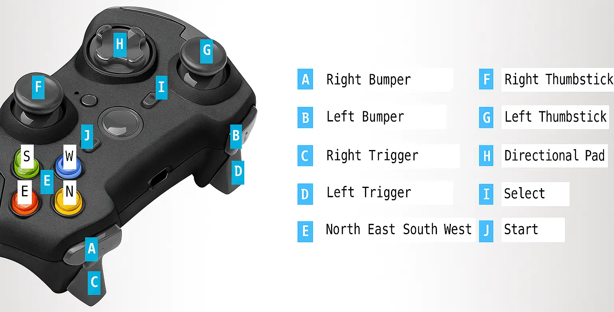
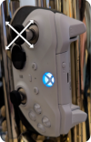
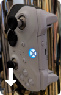

# Bindings

This page describes how the gamepad controls SousaFX.   
All of the parameters on this page can be viewed in the [Active Bindings](overview.md#active-bindings) window,   
but they may not yet be shown in their respective FX parameters windows.

## Start, Select, N E S W

Start and Select are used for modifying the functions of the North, East, South, and West buttons, as well as modifying the functions of the thumbsticks.

- Without start or select pressed:

	| Input       | Function |
	|-------------|----------|
	| North 	  | Tap tempo. |
	| East 		  | Drum [looper](loopers.md) start / stop / clear. |
	| South 	  | Momentarily enable main stutter.   To perma-enable: Press start/select before releasing South. |
	| West 		  | Bassline [looper](loopers.md) start / stop / clear. |
	| Thumbsticks | Described [below](bindings.md#left-thumbstick). |

- With select pressed:

	| Input            | Function |
	|------------------|----------|
	| North 	       | Toggle metronome. |
	| East 		       | Randomize drum samples. |
	| South 	       | Toggle bumper drumming. |
	| West 		       |  |
	| Left Thumbstick  | While holding Select, the left thumbstick can be used to set the lowpass filter LFO's shape (from falling saw, to triangle, to rising saw) and the lowpass filter LFO's curvature (from squished, to fattened). |

- With start pressed:

	| Input            | Function |
	|------------------|----------|
	| North 	       | Momentarily enable pitchshift power chord.   To perma-enable: Release start before releasing North.|
	| East 		       | Momentarily enable kick-ducker.   To perma-enable: Release start before releasing East.|
	| South 	       | Momentarily enable scatter fx for bassline looper stutter.   To perma-enable: Release start before releasing South.|
	| West 		       | |
	| Right Thumbstick | While using the right thumbstick to modulate any delay's feedback amount, pressing Start will place a hold on said feedback amount until the thumbstick is moved outside of its deadzone after either 16 bars have passed, or R3 (the right thumbstick button) is pressed. |

- With start and select pressed:

	| Input     | Function |
	|-----------|----------|
	| North 	| Set time signature numerator via number of clicks (3 - 7).   Hold to set to 4. |
	| East 		| Set drum looper length in bars via number of clicks (4 - 16).   Hold to set to 8. |
	| South 	| |
	| West 		| Set bassline looper length in bars via number of clicks (4 - 16).   Hold to set to 16. |

## Shoulder Buttons

While the tuba isn't playing, and the drum looper isn't looping, pressing the shoulder buttons triggers drum samples, and holding the shoulder buttons retriggers drum samples at the rate set by the d-pad.

| Button 	| Samples  |
|-----------|----------|
| Left Trigger 		| Clap     |
| Left Bumper 		| Snare    |
| Right Trigger 	| Tom      |
| Right Bumper 		| Kick     |

While the tuba is playing, or the drum looper is looping, the shoulder buttons operate as follows:

The left trigger, and right bumper, are used to adjust the function of the thumbsticks.

Holding the right trigger lets an ADSR modulate the overdriven lowpass filter whenever the tuba articulates.

### D-pad

The left bumper, and the d-pad, are used for setting the subdivision of the auto-wah, delays, and stutters.

The left trigger is used for changing the function of the d-pad and the left bumper.

- Without the left trigger pressed:

	| d-pad	    | Function	  |
	|-----------|-------------|
	| left bumper| enable manual lowpass filter frequency [control](bindings.md#horizontal) |
	| d-pad up 	| quarter |
	| up right	| dotted quarter |
	| right 	| 8th triplet |
	| down right| 16th triplet |
	| down		| 16th |
	| down left	| 32nd |
	| left		| 8th |
	| up left	| dotted eighth |

- With the left trigger pressed:

	| d-pad	    | Function	  |
	|-----------|-------------|
	| left bumper| half |
	| d-pad up 	| quarter triplet |
	| right 	| 16th triplet |
	| down		| quarter quintuplet |
	| left		| 8th quintuplet |

If a subdivision is triggered twice in a row, then while the button is held down the second time, the stutters are reversed, and the wah shifts to the offbeat. 

If the d-pad is pressed quickly, the delays will not pitch shift while the delay time changes, but if the d-pad is held briefly, then released, the delays will pitch shift while the delay time changes. This shift takes longer to go upwards than downwards.

## Left Thumbstick

### Vertical

- [Crossfade](overview.md#crossfade-env-sens) position. 

	> Up crossfades towards the overdriven modulated lowpass filter sound.

	> Down crossfades towards detuned dry sound. 

- Bassline looper filtersweep.

	> Up sweeps a highpass filter upwards.

	> Center bypasses these filters.

	> Down sweeps a lowpass filter downwards.

- LFO curvature:

	> Allowed only while Select is pressed. Value held when Select released.

	> > Up to squish.

	> > Down to fatten.

### Up 

- Drum stutter enable:

	> Allowed while the drum looper is looping, & the tuba isn't playing a bassline.

	> Momentarily disallowed while Right Bumper is held.

- Drum stutter autopan amount:

	> Allowed while drum stutter enabled.

### Horizontal

- Manual lowpass filter frequency control:

	> Allowed while the Left Bumper is [held](bindings.md#d-pad).

	> > Left sweeps the lowpass filter upwards. 

	> > Right sweeps the lowpass filter downwards.

- Drum filtersweep:

	> Allowed after the tuba *stops* playing, & the left thumbstick is within its deadzone.

	> Denied after the tuba *starts* playing, & the left thumbstick is within its deadzone.

	> > Left sweeps a highpass filter upwards. 

	> > Center bypasses these filters.

	> > Right sweeps a lowpass filter downwards.

- LFO shape:

	> Allowed while Select is pressed.

	> > Left for rising saw.

	> > Center for triangle.

	> > Right for falling saw.

### Left

- Bassline looper stutter enable:

	> Allowed after the bassline looper *starts* looping, & the left thumbstick is within its deadzone.

	> Denied after the bassline looper *stops* looping, & the left thumbstick is within its deadzone.

	> Momentarily disallowed while RB is held down.

- Bassline looper stutter autopan amount.

	> Allowed while bassline looper enabled.

### Diagonal

- LFO ceiling envelope sensitivity:

	> down-left increases the sensitivity.

	> up-right decreases the sensitivity.

- LFO floor envelope sensitivity:

	> up-left increases the sensitivity.

	> down-right decreases the sensitivity.

### L3 Button

Push L3 once, twice, or thrice in succession to set the [crossfader's](overview.md#crossfade-env-sens) mode. Once to enable the transient helper, twice to disable the transient helper, and thrice to disable the crossfade entirely. 

### Magnitude

- LPF resonance boost.

!!! note

	The magnitude is the distance of a thumbstick from its center.

## Right Thumbstick

### Up

- Bassline delay feedback amount, & solo delay feedback amount.

- Solo stutter autopan amount.

- Drum delay feedback amount:

	> Allowed after the tuba *stops* playing, & the right thumbstick is within its deadzone.

	> Denied after the tuba *starts* playing, & the right thumbstick is within its deadzone.

- LPF LFO acceleration:

	> Allowed after the left bumper is *released*, & the right thumbstick is within its deadzone.

	> Denied after the left bumper is *pressed*.

### Down

- Either LPF LFO decceleration, or swing amount, depending on subdivision.

- Bassline looper delay feedback amount.

### Horizontal

- Delays' feedback loops' highpass filter frequency adjustment for bassline, bassline looper, tuba solo, and drums.

	> Left towards 60 Hz.

	> Centered on 400 Hz.

	> Right towards 2100 Hz.

- Stutter Acceleration for bassline, bassline looper, tuba solo, and drums:

	> Allowed after the right bumper is *released*, the respective stutter is *enabled*, & the right thumbstick is within its deadzone.

	> Denied after the right bumper is *pressed*, or the respective stutter is *disabled*.

	> > Left increases the speed.

	> > Center returns to the original speed and phase.

	> > Right decreases the speed.

- Drum retrigger rate acceleration:

	> Allowed while the drum samples are being retriggered by holding down the bumpers.

	> > Left increases the speed.

	> > Center returns to the original speed and phase.

	> > Right decreases the speed.

### Left

- Main delay send & solo delay send:

	> Denied after the right bumper is *pressed*.

	> Allowed after the right bumper is *released*, & the right thumbstick is within its deadzone.

- Drum delay send, and bassline looper delay send:

	> Allowed after the tuba *stops* playing, & the right thumbstick is within its deadzone, & the right bumper is *released*.

	> Disallowed after the tuba *starts* playing, & the right thumbstick is within its deadzone. 

	> Also disallowed after the right bumper is *pressed*.

### Right

- Main reverb send.

- Bassline looper reverb send, and Drum reverb send:

	> Allowed after the tuba *stops* playing, & the right thumbstick is within its deadzone.

	> Denied after the tuba *starts* playing, & the right thumbstick is within its deadzone.

### R3 Button

After pressing Start to place a hold on a delay feedback amount, pressing R3 will remove the hold. The hold is auto-removed after 16 bars regardless.

