

# Bindings

This page describes how the gamepad controls SousaFX. All of the parameters on this page can be viewed in the [Active Bindings](overview.md#active-bindings) window, but they may not yet be shown in their respective FX parameters windows.

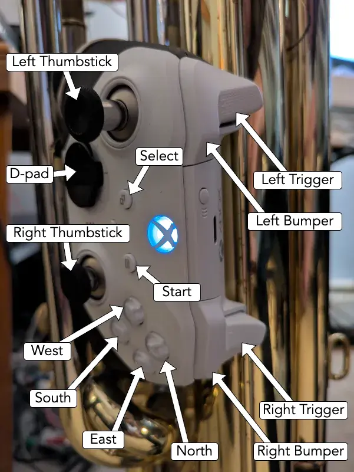

## Start, Select, N E S W

Start and Select are used for modifying the functions of the North, East, South, and West buttons, as well as modifying the functions of the thumbsticks.

- Without start or select pressed:

	| Input       | Function |
	|-------------|----------|
	| North 	  | Tap tempo. Last tap sets beat 1. Tap once to set beat 1 without changing tempo. Metronome auto-mutes while tapping.|
	| East 		  | Drum [looper](loopers.md) start / stop / clear. |
	| South 	  | Momentarily enable main stutter.   To perma-enable: Hold start or select before releasing South. |
	| West 		  | Bassline [looper](loopers.md) start / stop / clear. |

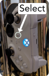

- With select pressed:

	| Input            | Function |
	|------------------|----------|
	| North 	       | Toggle metronome. |
	| East 		       | Randomize drum samples. |
	| South 	       | Toggle bumper drumming. |
	| West 		       | Releases any holds on all delay feedback amounts. |
	| Right Thumbstick | While using the right thumbstick to modulate any delay feedback amount, pressing Select will place a hold on said feedback amount. |

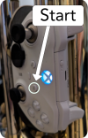

- With start pressed:

	| Input            | Function |
	|------------------|----------|
	| North 	       | Momentarily enable pitchshift power chord.   To perma-enable: Release start before releasing North.|
	| East 		       | Momentarily enable kick-ducker.   To perma-enable: Release start before releasing East.|
	| South 	       | Momentarily enable scatter fx for bassline looper stutter.   To perma-enable: Release start before releasing South.|
	| West 		       | Momentarily enable MIDI CC 50 via the MIDI port named "from Max 1", which is intended to be mapped to a talkback mic.|
	| Left Thumbstick  | While holding Start, the left thumbstick sets the lowpass filter modulation shape: The horizontal axis crossfades from falling saw, to triangle, to rising saw. The down axis squishes the triangle, and the up axis crossfades from triangle to square. |

- With start and select pressed:

	| Input     | Function |
	|-----------|----------|
	| North 	| Set time signature numerator via number of clicks (3 - 7).   Hold to set to 4. |
	| East 		| Set drum looper length in bars via number of clicks (4 - 16).   Hold to set to 8. |
	| South 	| Nothing yet. |
	| West 		| Set bassline looper length in bars via number of clicks (4 - 16).   Hold to set to 16. |

## Shoulder Buttons

While bumper drumming is enabled, pressing the shoulder buttons triggers drum samples, and holding the shoulder buttons retriggers drum samples at the rate set by the d-pad.

| Button 	| Samples  |
|-----------|----------|
| Left Trigger 		| Clap     |
| Left Bumper 		| Snare    |
| Right Trigger 	| Tom      |
| Right Bumper 		| Kick     |

While bumper drumming is disabled (which happens automatically while the tuba is playing, or the drum looper is looping) the shoulder buttons operate as follows:

| Button 	| Samples  |
|-----------|----------|
| Left Trigger 		| Changes the subivisions set by the d-pad and left bumper.   Also momentarily disables the lowpass filter modulation acceleration until the right thumbstick is within its deadzone. |
| Left Bumper 		| Without the Left Trigger pressed: Momentarily enables the manual wah.   With the Left Trigger pressed: Sets subdivision to half note. |
| Right Trigger 	| Nothing. |
| Right Bumper 		| Momentarily disables the stutter for the drum looper and bassline looper. |

### D-pad

The left bumper, and the d-pad, are used for setting the subdivision of the auto-wah, delays, and stutters.

The left trigger is used for changing the function of the d-pad and the left bumper.

- Without the left trigger pressed:

	| d-pad	    | Function	  |
	|-----------|-------------|
	| left bumper| Momentarily enable manual wah |
	| d-pad up 	| quarter |
	| up right	| dotted quarter |
	| right 	| 8th triplet |
	| down right| 16th triplet |
	| down		| 16th |
	| down left	| 32nd |
	| left		| 8th |
	| up left	| dotted eighth |

- With the left trigger pressed:

	| d-pad	    | Function	  |
	|-----------|-------------|
	| left bumper| half |
	| d-pad up 	| quarter triplet |
	| right 	| 16th triplet |
	| down		| quarter quintuplet |
	| left		| 8th quintuplet |

If a subdivision is triggered twice in a row, then while the button is held down the second time, the stutters are reversed, and the wah shifts to the offbeat. 

If the d-pad is pressed quickly, the delays will not pitch shift while the delay time changes, but if the d-pad is held briefly, then released, the delays will pitch shift while the delay time changes. This shift takes longer to go upwards than downwards.

## Left Thumbstick

### Vertical

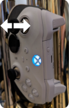

- [Crossfade](overview.md#crossfade-env-sens) position. 

	> Up crossfades towards the overdriven modulated lowpass filter sound.

	> Down crossfades towards the detuned dry sound. 

- LFO floor envelope sensitivity:

	> Up increases the sensitivity.

	> Down decreases the sensitivity.

- Bassline looper filtersweep.

	> Up sweeps a highpass filter upwards.

	> Center bypasses these filters.

	> Down sweeps a lowpass filter downwards.

- LFO shape:

	> Can only be set while Start is pressed. The set value is held after Start is released.

	> > Down to squish the triangle.

	> > Center for triangle.

	> > Up to morph to square.

### Up 

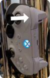

- Drum stutter enable:

	> Allowed while the drum looper is looping, & the tuba isn't playing a bassline.

	> Momentarily disallowed while Right Bumper is held.

- Drum stutter autopan amount:

	> Allowed while drum stutter enabled.

### Horizontal

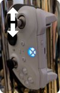

- Drum filtersweep:

	> Allowed after the tuba *stops* playing, & the left thumbstick is within its deadzone.

	> Denied after the tuba *starts* playing, & the left thumbstick is within its deadzone.

	> > Left sweeps a highpass filter upwards. 

	> > Center bypasses these filters.

	> > Right sweeps a lowpass filter downwards.

- LFO shape:

	> Can only be set while Start is pressed. The set value is held after Start is released.

	> > Left for rising saw.

	> > Center for triangle.

	> > Right for falling saw.

- LFO ceiling envelope sensitivity:

	> Left increases the sensitivity.

	> Right decreases the sensitivity.

### Left

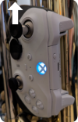

- Bassline looper stutter enable:

	> Allowed after the bassline looper *starts* looping, & the left thumbstick is within its deadzone.

	> Denied after the bassline looper *stops* looping, & the left thumbstick is within its deadzone.

	> Momentarily disallowed while the right bumper is held down.

- Bassline looper stutter autopan amount.

	> Allowed while bassline looper enabled.

### L3 Button

- Push L3 once, twice, or thrice in succession to set the [crossfader's](overview.md#crossfade-env-sens) mode. 
	
	1. Once to enable the "transient helper", which increases the crossfade whenever the noisegate is gating.
	
	2. Twice to disable the "transient helper". 
	
	3. Thrice to disable the crossfade entirely. 

- Push Start & L3 to toggle weither the tuba's loudness modulates the LPF LFO's ceiling and floor.

## Right Thumbstick

### Up

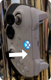

- Bassline delay feedback amount, & solo delay feedback amount.

- Solo stutter autopan amount.

- Drum delay feedback amount:

	> Allowed after the tuba *stops* playing, & the right thumbstick is within its deadzone.

	> Denied after the tuba *starts* playing, & the right thumbstick is within its deadzone.

- LPF LFO acceleration:

	> Allowed after the left trigger is *released*, & the right thumbstick is within its deadzone.

	> Denied after the left trigger is *pressed*.

### Down

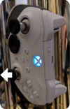

- Either LPF LFO decceleration, or swing amount, depending on [R3](bindings.md#r3-button).

- Bassline looper delay feedback amount.

### Horizontal

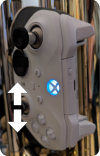

- Delays' feedback loops' highpass filter frequency adjustment for bassline, bassline looper, tuba solo, and drums.

	> Left towards 60 Hz.

	> Centered on 400 Hz.

	> Right towards 2100 Hz.

- Stutter Acceleration for bassline, bassline looper, tuba solo, and drums:

	> Allowed after the right bumper is *released*, the respective stutter is *enabled*, & the right thumbstick is within its deadzone.

	> Denied after the right bumper is *pressed*, or the respective stutter is *disabled*.

	> > Left increases the speed.

	> > Center returns to the original speed and phase.

	> > Right decreases the speed.

- Free LFO speed:

	> Allowed when [R3](bindings.md#r3-button) pressed thrice.

	> > Left increases the speed.

	> > Right decreases the speed.

### Left

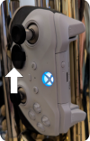

- Main delay send & solo delay send:

	> Denied after the right bumper is *pressed*.

	> Allowed after the right bumper is *released*, & the right thumbstick is within its deadzone.

- Drum delay send, and bassline looper delay send:

	> Allowed after the tuba *stops* playing, & the right thumbstick is within its deadzone, & the right bumper is *released*.

	> Disallowed after the tuba *starts* playing, & the right thumbstick is within its deadzone. 

	> Also disallowed after the right bumper is *pressed*.

### Right

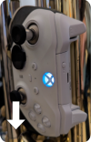

- Main reverb send.

- Bassline looper reverb send, and Drum reverb send:

	> Allowed after the tuba *stops* playing, & the right thumbstick is within its deadzone.

	> Denied after the tuba *starts* playing, & the right thumbstick is within its deadzone.

### R3 Button

Push R3 once, twice, or thrice in succession to switch the right thumbstick's bindings for the lowpass filter's LFO.

1. Once for the vertical axis to control the acceleration (up accelerates, down deccelerates).

2. Twice for the up axis to control the acceleration, and the down axis to control the swing amount.

3. Thrice for the up axis to control the sync-free crossfade, the horizontal axis to control the free rate (left for faster, right for slower), and the down axis to control the swing amount.

