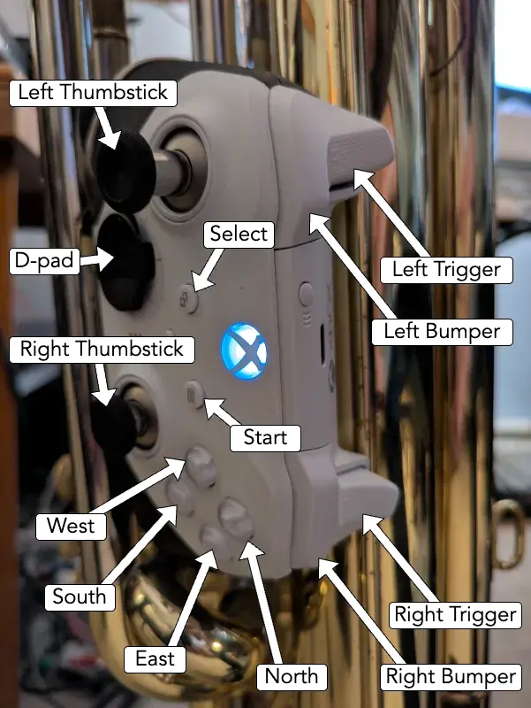

# Bindings

## Start, Select, N E S W

Start and Select are used for changing the function of the North, East, South, and West buttons.

- Without start or select pressed:

	| Direction | Function |
	|-----------|----------|
	| North 	| Tap tempo. |
	| East 		| Drum [looper](loopers.md) start / stop / clear. |
	| South 	| Momentarily enable main stutter.   To perma-enable: Press start/select before releasing South. |
	| West 		| Bassline [looper](loopers.md) start / stop / clear. |

- With start pressed:

	| Direction | Function |
	|-----------|----------|
	| North 	| Momentarily enable pitchshift power chord.   To perma-enable: Release start before releasing North.|
	| East 		| Momentarily enable kick-ducker.   To perma-enable: Release start before releasing East.|
	| South 	| Momentarily enable scatter fx for bassline looper stutter.   To perma-enable: Release start before releasing South.|
	| West 		| |

- With select pressed:

	| Direction | Function |
	|-----------|----------|
	| North 	| Toggle metronome. |
	| East 		| Randomize drum samples. |
	| South 	| Toggle bumper drumming. |
	| West 		|  |

- With start and select pressed:

	| Direction | Function |
	|-----------|----------|
	| North 	| Set time signature numerator via number of clicks (3 - 7).   Hold to set to 4. |
	| East 		| Set drum looper length in bars via number of clicks (4 - 16).   Hold to set to 8. |
	| South 	|  |
	| West 		| Set bassline looper length in bars via number of clicks (4 - 16).   Hold to set to 16. |

## Shoulder Buttons

While the tuba isn't playing, and the drum looper isn't looping, pressing the shoulder buttons triggers drum samples, and holding the shoulder buttons retriggers drum samples at the rate set by the d-pad.

| Button 	| Samples  |
|-----------|----------|
| Left Trigger 		| Clap     |
| Left Bumper 		| Snare    |
| Right Trigger 	| Tom      |
| Right Bumper 		| Kick     |

While the tuba is playing, or the drum looper is looping, the shoulder buttons operate as follows:

The left trigger, and right bumper, are used to adjust the function of the thumbsticks.

Holding the right trigger lets an ADSR modulate the overdriven lowpass filter whenever the tuba articulates.

### D-pad

The left bumper, and the d-pad, are used for setting the subdivision of the auto-wah, delays, and stutters.

The left trigger is used for changing the function of the d-pad and the left bumper.

- Without the left trigger pressed:

	| d-pad	    | Function	  |
	|-----------|-------------|
	| LB 		| enable manual filter frequency control |
	| d-pad up 	| quarter |
	| up right	| dotted quarter |
	| right 	| 8th triplet |
	| down right| 16th triplet |
	| down		| 16th |
	| down left	| 32nd |
	| left		| 8th |
	| up left	| dotted eighth |

- With the left trigger pressed:

	| d-pad	    | Function	  |
	|-----------|-------------|
	| LB 		| half |
	| d-pad up 	| quarter triplet |
	| right 	| 16th triplet |
	| down		| quarter quintuplet |
	| left		| 8th quintuplet |

If a subdivision is triggered twice in a row, then while the button is held down the second time, the stutters are reversed, and the wah shifts to the offbeat. 

If the d-pad is pressed quickly, the delays will not pitch shift while the delay time changes, but if the d-pad is held briefly, then released, the delays will pitch shift while the delay time changes. This shift takes longer to go upwards than downwards.

## Left Thumbstick

### Vertical

- LFO floor envelope sensitivity.

- Crossfade position.

- Bassline looper filtersweep.

- LFO Pow:

	Allowed while select is pressed.

### Up 

- Drum stutter enable:

	Allowed while the drum looper is looping, & the tuba isn't playing a bassline.

	Momentarily disallowed while RB is held down.

- Drum stutter autopan amount.

### Horizontal

- LFO ceiling envelope sensitivity.

- Drum filter sweep:

	Allowed when the tuba's silent, & the left thumbstick is within its deadzone.

	Denied when the tuba's playing, & the left thumbstick is within its deadzone.

- LFO shape:

	Allowed while select is pressed.

### Left

- Bassline looper stutter enable:

	Allowed when the bassline looper is looping, & the left thumbstick is within its deadzone.

	Denied when the bassline looper isn't looping, & the left thumbstick is within its deadzone.

	Momentarily disallowed while RB is held down.

- Looper stutter autopan amount.

### Magnitude

- Lowpass filter resonance boost.

- Manual filter frequency control.

	Allowed only while the left bumper is held.

!!! note

	The magnitude is the distance of the thumbstick from the center.

## Right Thumbstick

### Up

- Bassline delay feedback amount, & solo delay feedback amount.

- Solo stutter autopan amount.

- Drum delay feedback amount:

	Allowed when the tuba's silent, & the right thumbstick is within its deadzone.

	Denied when tuba starts playing, & the right thumbstick is within its deadzone.

- LFO acceleration:

	Allowed when the right bumper is released, & the right thumbstick is within its deadzone.

	Denied when the right bumper is pressed, & the right thumbstick is within its deadzone.

### Down

- Either LFO decceleration, or swing amount, depending on subdivision.

- Bassline looper delay feedback amount:

	Allowed when the tuba's silent, & the right thumbstick is within its deadzone.

	Denied when tuba starts playing.

### Horizontal

- Delay's feedback loop's lowpass filter frequency adjustment (200 Hz - 5.8 kHz) for bassline, solo, drums, and loopers.

- Stutter Acceleration for bassline, solo, drums, and loopers:

	Allowed when the right bumper is released, & the right thumbstick is within its deadzone.

	Denied when the right bumper is pressed, & the right thumbstick is within its deadzone.

- Drum retrigger rate acceleration:

	While the drum samples are being retriggered, this changes the speed.

### Left

- Bassline delay send & solo delay send:

	Denied when the left trigger is pressed.

	Allowed when the left trigger is released, & the right thumbstick is within its deadzone.

- Drum delay send, and bassline looper delay send:

	Allowed when the tuba's silent, & the right thumbstick is within its deadzone.

	Disallowed when the tuba starts playing.

### Right

- Main reverb send.

- Bassline looper reverb send, and Drum reverb send:

	Allowed when the tuba's silent, & the right thumbstick is within its deadzone.

	Denied when the tuba's playing, & the right thumbstick is within its deadzone.

