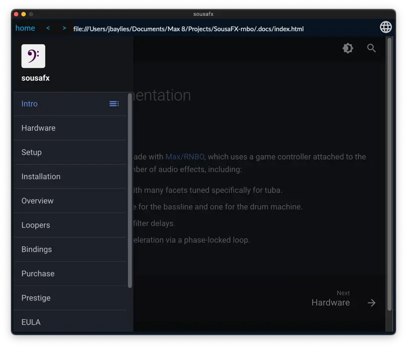

# Documentation

The documentation is available offline within SousaFX.

While any window is active, pressing option+d or option+h will open the relevant section in the documentation window. Windows can be opened via the "FX Parameters" menu in the menubar.

While mousing over the gamepad input display, looper statuses, layout saver, or save/restore buttons in the main window, pressing opt+d/h should open those sections respectively.

!!! Bug 

	In the offline docs, after typing in the search bar, click the "Type to Start Searching" text to search.
