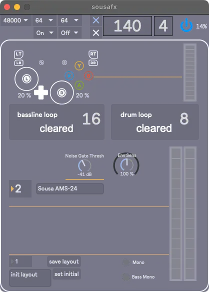
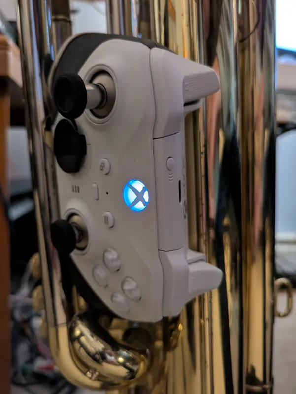
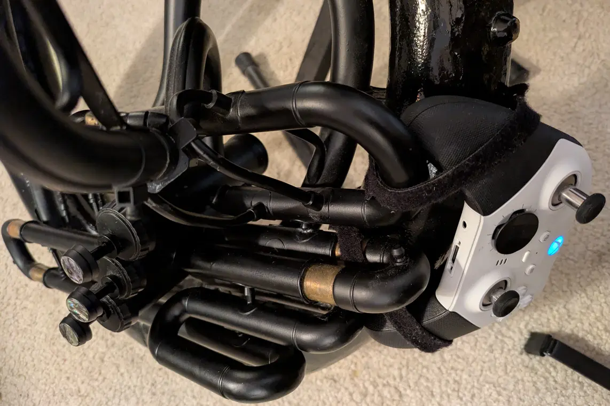

# Introduction

SousaFX is a multi-effects rig made with [Max/RNBO](https://cycling74.com/products/rnbo) with the goal of bringing [dubstep](recommended_listening.md) (and other wobble-bass genres) into the repertoire of genres that tuba players can perform. A game controller attached to the side of the instrument is used to control a number of audio effects, including:

- An auto-wah carefully tuned to be as musical as possible.
- DJ-style lowpass / highpass filters.
- Two one-button loopers, one for the bassline and one for the drums.
- 64 drum samples, playable with the bumpers and triggers.
- Dub delays with separate parameters for input volume, feedback amount, and highpass frequency.
- Reversible, scatterable stutters with acceleration via phase-locked loops.

-   

-   

-   

<html lang="en">
<head>
    <meta charset="UTF-8">
    <meta name="viewport" content="width=device-width, initial-scale=1.0">
    
</head>
<body>

<form method="post" action="https://sousastep.pikapod.net/subscription/form" class="listmonk-form">
    

        <input type="hidden" name="nonce" />
        
<input type="email" name="email" required placeholder="E-mail" />

        
<input type="text" name="name" placeholder="Name (optional)" />

        

            <input id="94875" type="checkbox" name="l" checked value="94875614-88f9-49e2-8f9a-78e5e6e1aac3" />
            <label for="94875">Stay informed about new releases.</label>
        

        
<input type="submit" value="Subscribe" />

    

</form>

</body>
</html>
