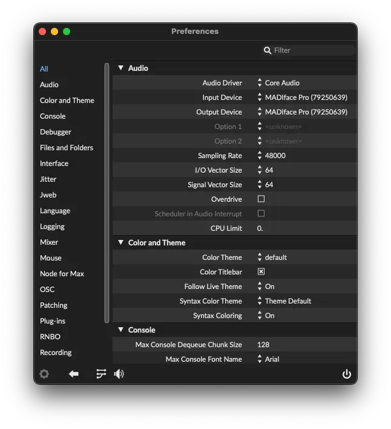
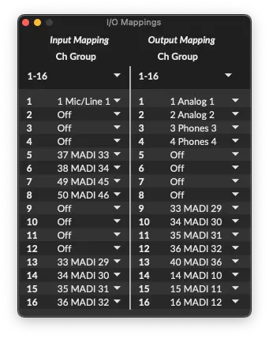

# Installation

1. [Download Max 9](https://cycling74.com/downloads) from Cycling ‘74 and launch it.

	!!! note

		SousaFX remains fully functional after [Max’s 30-day trial ends](https://support.cycling74.com/hc/en-us/articles/360049995834-Max-8-Max-7-Authorization#link-2). Max authorization is not required.
	 

2. Click on "menubar > Max > Preferences..."

	

	- Set the Audio Input Device and Output Device to the connected audio interface.
	- Set the Sampling Rate to 48000.
	- Set the two Vector Sizes to 256 or less. Lower vector sizes result in lower latency, but a higher possibility of CPU-overload-induced crackles in the audio.
	- Overdrive and Scheduler in Audio Interrupt can be off.
	- Click the "Audio I/O Mappings" button on the bottom left, to the left of the speaker button. These mapping will likely be correct by default.

	

	- Set Input Mapping 1 to the tuba's mic. (For my interface that's "Mic/Line 1")
	- Set Output Mapping 1-2 to the speaker outputs, and 3-4 to the monitor/headphone outputs. (For my interface that's "Analog 1" for the left speaker output, "Analog 2" for the right speaker output, "Phones 3" for the left headphone output, and "Phones 4" for the right headphone output)
	- The rest of the IO mappings can be Off.

	 

3. Download SousaFX-v0.11.2.zip by clicking this link: [Download](https://github.com/Sousastep/SousaFX-rnbo/releases/download/v0.11.2/SousaFX-v0.11.2.zip) 

	- Unzip `SousaFX-v0.11.2.zip`, and move the `SousaFX-v0.11.2` folder into your `~/‍Documents/‍Max 9/‍Projects/` folder (create the Projects folder if it doesn't exist).

	- If you have previously installed SousaFX, then replace the `data` folder in the current version of SousaFX with the `data` folder from the old version of SousaFX.

	- Double-click `SousaFX-v0.11.2.maxproj` to launch the rig.

	!!! note

		SousaFX remains fully functional after [SousaFX's 30-day trial ends](purchase.md).
	 

4. Optional: Sign up for the mailing list to be informed about new releases.

<html lang="en">
<head>
    <meta charset="UTF-8">
    <meta name="viewport" content="width=device-width, initial-scale=1.0">
    
</head>
<body>

<form method="post" action="https://sousastep.pikapod.net/subscription/form" class="listmonk-form">
    

        <input type="hidden" name="nonce" />
        
<input type="email" name="email" required placeholder="E-mail" />

        
<input type="text" name="name" placeholder="Name (optional)" />

        

            <input id="94875" type="checkbox" name="l" checked value="94875614-88f9-49e2-8f9a-78e5e6e1aac3" />
            <label for="94875">Stay informed about new releases.</label>
        

        
<input type="submit" value="Subscribe" />

    

</form>

</body>
</html>