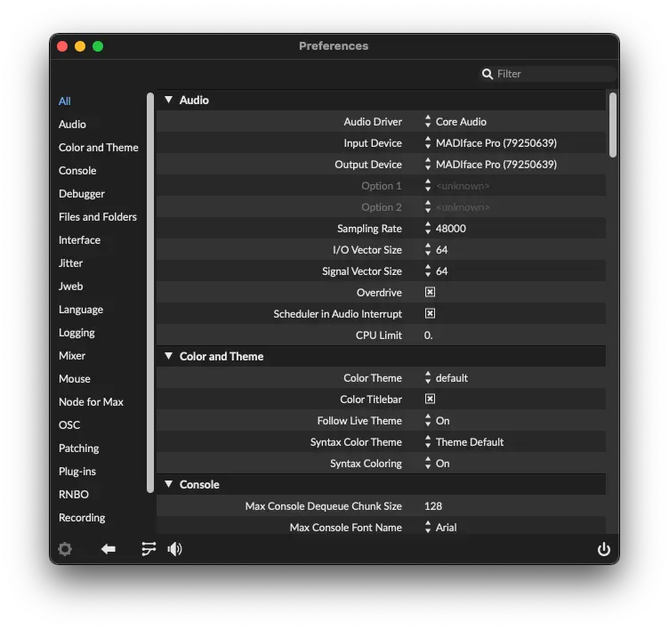

# Installation

1. [Download Max 9](https://cycling74.com/downloads) from Cycling ‘74 and launch it.

	!!! note

		SousaFX remains fully functional after [Max’s 30-day trial ends](https://support.cycling74.com/hc/en-us/articles/360049995834-Max-8-Max-7-Authorization#link-2). Max authorization is not required.
	 

2. Click on "menubar > Max > Preferences..."

	

	- Set the Audio Input Device and Output Device to the connected audio interface.
	- Set the Sampling Rate to 48000
	- Set the two Vector Sizes to 64.
	- Enable Overdrive and Scheduler in Audio Interrupt.
	- Click the "Audio I/O Mappings" button on the bottom left, to the left of the speaker button.
	- Set Input Mapping 1 to the tuba's mic.
	- Set Output Mapping 1-2 to the speaker outputs, and 3-4 to the monitor/headphone outputs.

		

3. Download [SousaFX](https://github.com/Sousastep/SousaFX-rnbo/releases) to your `~/Documents/​Max 9/​Projects/` folder, then double-click `SousaFX-rnbo.maxproj` to launch the rig.

	!!! note

		SousaFX remains fully functional after [SousaFX's 30-day trial ends](purchase.md).

