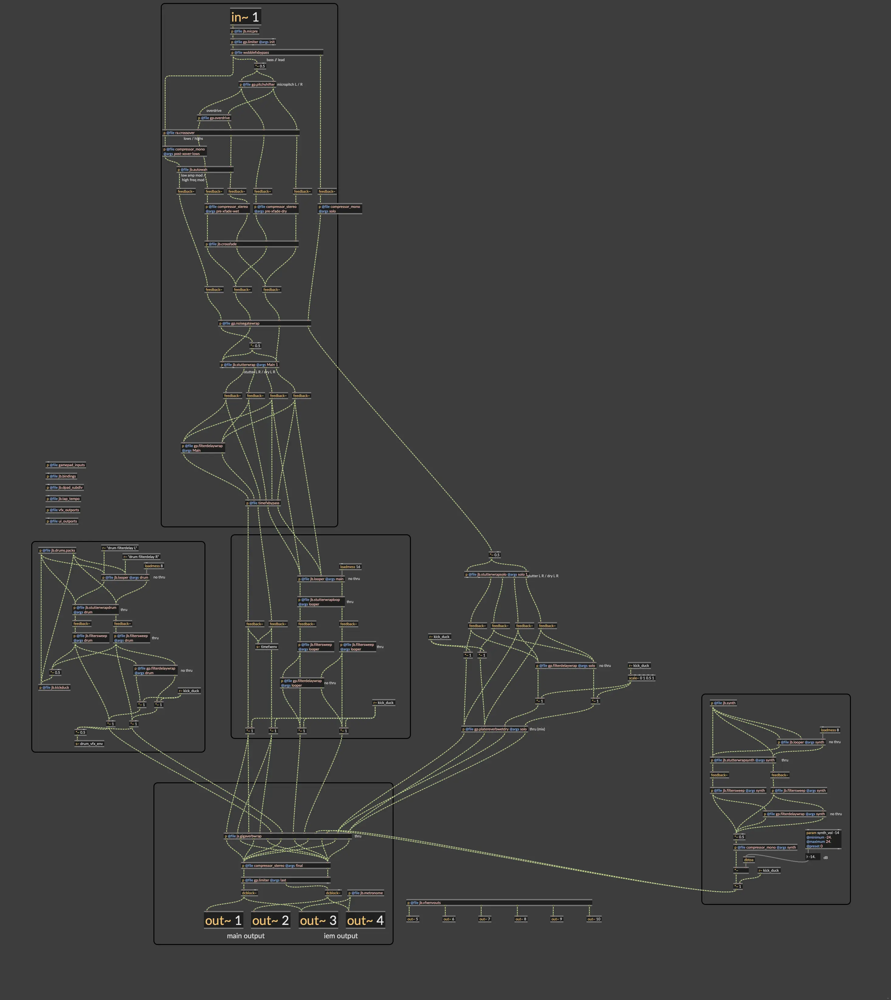

# Modding

For release versions, the core of SousaFX-rnbo is compiled into a max external, and can not be opened.

To access the internals:

Clone this repository: [https://github.com/Sousastep/SousaFX-rnbo](https://github.com/Sousastep/SousaFX-rnbo) (or click the green "Code" button, then click "Download ZIP")

Double-click `SousaFX-rnbo.maxproj`, then wait a minute for it to compile.

Press `option m`, or click `menubar > File > Max Menus` to disable the custom menubar.

Press `option command e`, or click `menubar > View > Presentation` to exit presentation mode.

Click the message that says `window flags nofloat, window flags zoom, window flags grow, window exec, savewindow 0`

Double-click the title bar to fullscreen the window.

Find the `rnbo~ @patchername gamepad_input @parameter_enable 0 @autosave 0 @autobuild 1` object, and double-click it.

On the bottom left of the inaptly-named "gamepad_input" patcher window, click the "Disable Auto-Compile" toggle, otherwise any small change triggers a 1-minute recompilation.

Press `option command m`, or click the pencil icon in the bottom left, to modify read-only.

{target="_blank"}

Feel free to ask questions in the discord, linked in the bottom right ↘

