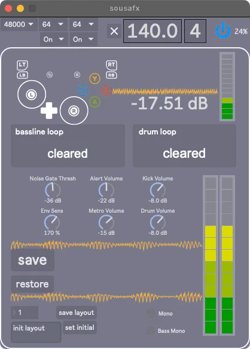
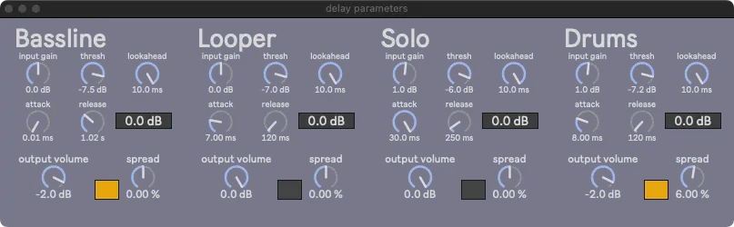
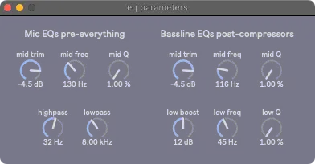

# Overview

This overview describes all the parameters in SousaFX's interface. Generally, these parameters handle the overall mix and tone, while the [gamepad](bindings.md) triggers and modulates the FX.

## Main Window

Closing this window quits SousaFX.

### Status Bar

The menus on the top left adjust the audio engine's settings, including the sample rate, signal vector size, I/O vector size, Overdrive, and Interrupt, which should be set to 48000, <= 128, <= 128, Off, and Off, respectively.

The top "X" toggle rounds the tempo to an integer.

The bottom "X" toggle makes the white border flash in time with the metronome.

To the right of the toggles is the tempo in beats per minute, which can be set by tapping [North](bindings.md#start-select-n-e-s-w).

Next is the time signature numerator, which can be set by tapping [North](bindings.md#start-select-n-e-s-w) while holding Start and Select. 

Next is the audio engine power button, along with the CPU meter. The audio engine will auto-start when SousaFX is launched, and can be toggled off to mute SousaFX.

### Displays

To the top left of the white box, is the game controller input display. The two percentages set the size of the respective thumbstick's [deadzone](https://minimuino.github.io/thumbstick-deadzones/).

To the right are the input volume meters. 

Below are the status displays for the [tuba bassline looper, and drum looper](loopers.md). The number displays the loop length in bars.

| color     | status 	|
|-----------|-----------|
| grey 		| cleared 	|
| red 		| recording	|
| green 	| playing 	|
| orange 	| stopping 	|

### Dials

- Noise Gate Thresh

	Sets the volume underneath which the tuba's input signal will be silent. The louder the environment is, the higher this will need to be.

- Env Sens

	Sets the main envelope sensitivity, which should generally be around 180%

### Save Restore

The Save button saves all the parameters in the main window (except for the window layout), and all the FX parameters windows.

The Restore button discards all changes and restores the previous save.

### Layout

On the bottom left is a way to save window layouts. Click the number box and press the up or down key to cycle through the window layout presets. Type a description in the textbox, and click "save layout" to save the current window layout with the description to the current preset number. Click "set initial" to set the current preset number as the initial preset to load on launch.

## Menubar

The following windows may be opened via the FX Parameters menu:

- [Active Bindings](overview.md#active-bindings)

- [Bassline](overview.md#bassline)

- [Compressors and Limiters](overview.md#compressors-and-limiters)

- [Delays](overview.md#delays)

- [Mixbus](overview.md#mixbus)

- [EQs](overview.md#eqs)

## Active Bindings

This window displays any FX parameters that are currently being adjusted by the [gamepad](bindings.md). It is the only window that can be resized by dragging the border.

## Bassline

This is the heart of SousaFX, and sets the tone of the bassline. We'll start with the topmost dial:

### crossfade env sens

This dial adjusts the envelope sensitivity for the crossfader, which crossfades between the overdriven modulated lowpass filter sound, and the dry detuned sound. When the tuba begins a phrase, the crossfade starts on the the dry sound, then quickly follows the envelope over to the filtered sound. The louder the tuba plays, the less filtered, and dryer, the sound can become.

The crossfade's range is actively adjusted via the "Crossfade Position" [binding](bindings.md#left-thumbstick). The crosfade's behavior can be modified with the left joystick's [button](bindings.md#l3-button).

### LFO env sens

This dial adjusts the incoming envelope sensitivity for the LFO's ceiling and floor.

This LFO modulates the lowpass filter frequency to create the dubstep wobble sound.

The louder the tuba plays, the higher the LFO's ceiling and floor become.

In addition, two [bindings](bindings.md#diagonal) adjust the ceiling and floor envelope sensitivities separately as well:

- LFO floor envelope sensitivity

- LFO ceiling envelope sensitivity

The following dials curve the aformentioned bindings:

- LFO ceiling env sens binding curve

- LFO floor env sens binding curve

The four dials below adjust the floor and ceiling's minimums and maximums:

- Max Dist Over Floor

- Min Dist Over Floor

- Max Floor

- Min Floor

### LPF menu

There are three different lowpass filters to choose from:

- Korg 35

- Andrew Simper's SVF

- Vadim Zavalishin's diode ladder

The toggle on the left allows the lowpass filter type to randomize whenever the bassline looper starts looping.

The minimum and maximum resonance for each filter can be set via the six number boxes.

### Detune

These parameters set the tone of the dryer detuned sound on the louder end of the crossfade. This signal is compressed by the pre-xfade-dry compressor.

- mix

	wet / dry mixer, 100% is all wet signal

- spread

	the amount of detune between the left and right channels in cents

- window

	longer window = higher quality, but higher latency

### Overdrive

These parameters set the tone of the overdriven lowpass filtered sound on the quieter end of the crossfade. This signal is compressed by the pre-xfade-wet conpressor.

- mix

	wet / dry mixer, 100% is all wet signal

- drive

	overdrive amount

- high cut

- low cut

- treble

- mid

	This mid boost is tamed by the pre-xfade-wet conpressor's sidechain eq's "hi mid gain".

- midfreq

- bass

- output volume

## Compressors and Limiters

This window displays two limiters and six compressors

- Initial Limiter

	This limiter is immediately after the mic input and cuts the top off of all the attacks so that the compressors further down the chain don't have to work as hard.

!!! note

	There's a 90 Hz crossover filter that separates the tuba's highs and lows pre-overdrive, to keep the lows clean.

- post-xover-lows

	This compressor is for the clean lows.

- pre-xfade-wet

	This compressor is for the overdriven modulated lowpass filter sound.

- pre-xfade-dry

	This compressor is for the detuned dry sound.

- solo

	This compressor is for the tuba solo, which only occurs while the bassline looper is looping.

- final

	This compressor is for the final mixdown.

- Last Limiter

	This limiter is after the final compressor.

## Delays

This window displays four delays for the bassline input, the bassline looper, the tuba solo, and the drums. The [d-pad](bindings.md/#d-pad) controls the delays' subdivisions, and the thumbsticks control the delays' send amount, feedback amount, and highpass filter frequency.

- input gain

	The delay's input volume.

- thresh

	Set the threshold of the limiter in the delay's feedback loop.

- lookahead
	
	Set the lookahead of the limiter.

- attack

	Set the attack of the limiter.

- release

	Set the release of the limiter.

- reduction amount

	Displays the limiter's gain reduction amount.

- output volume

	The delay's output volume.

- spread

	Adjust the difference in delay time between the left and right channels.

- filter toggle

	Toggle the lowpass filter in the delay's feedback loop.

## Mixbus

### Reverb

The drums, bassline, and solo are sent to this reverb.

- mix

	wet / dry mixer, keep at 100%.

- size

	The size of the room.

- diff

	The amount of diffusion.

- damp

	The amount of damping.

- decay

	The length of the decay.

- Jitter

	The amount of jitter.

### Monitors

- Loop Alert

	Sets the volume of the looper status alerts in the monitor output.

- Metronome

	Sets the volume of the metronome in the monitor output.

### Tuba Solo

- dry vol

	The volume of the tuba solo's "dry" signal, which includes the mic eq, pitch shifter, and solo compressor, and does not include the delay or stutter. This parameter can be quite low if you're playing in a small room.

- delay vol

	The volume of the tuba solo's delay effect.

- stutter vol

	The volume of the tuba solo's stutter effect.

- minimum solo reverb volume

	The minimum volume of the tuba solo's reverb effect.

### Drums

- Kick, Snare, Tom, Clap

	Sets the volume of the kick, snare, tom, and clap samples.

- minimum drum reverb volume

	The minimum volume of the drum's reverb effect.

## EQs

Low-mid frequencies tend to build up for various reasons. The mic and bassline's mid-EQs can tame those frequencies.

The tuba's sub frequencies drop precipitously below 60 Hz. The low boost can compensate for that to an extent. This can, however, exacerbate feedback.

The mic's lowpass cuts extraneous high frequencies from the mic's input signal.

