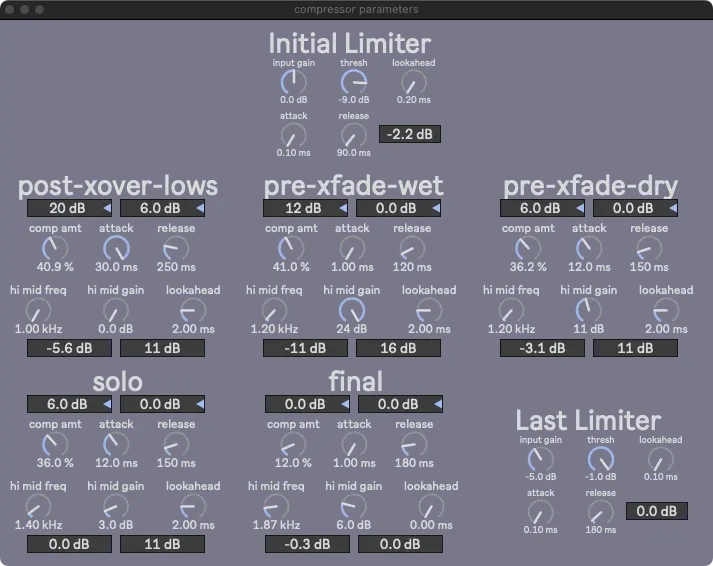

# Overview

## Menubar

The following windows may be opened via the FX Parameters menu:

- [Bassline](overview.md#bassline)

- [Compressors and Limiters](overview.md#compressors-and-limiters)

- [Delays](overview.md#delays)

- [Reverbs](overview.md#reverbs)

## Main Window

Closing this window quits SousaFX.

### Status Bar

The menus on the top left adjust the audio engine's settings, including the sample rate, signal vector size, I/O vector size, Overdrive, and Interrupt, which should be set to 48000, < 128, < 128, On, and On, respectively.

The x toggle makes the white border flash in time with the metronome.

To the right of the toggle is the tempo in beats per minute, which can be set by tapping [North](bindings.md#start-select-cardinal).

Next is the time signature numerator, which can be set by tapping [North](bindings.md#start-select-cardinal) while holding Start and Select. 

Next is the audio engine power button, along with the CPU meter. The audio engine will auto-start when SousaFX is launched, and can be toggled off to mute SousaFX.

### Displays

To the top left of the white box, is the game controller input display.

To the right are the input volume meters. 

Below are the Looper Status displays for the tuba bassline looper, and drum looper.

| color     | status 	|
|-----------|-----------|
| grey 		| cleared 	|
| red 		| recording	|
| green 	| playing 	|
| orange 	| stopping 	|

### Dials

- Noise Gate Thresh

	Sets the volume underneath which the tuba's input signal will be silent. The louder the environment is, the higher this will need to be.

- Env Sens

	Sets the main envelope sensitivity, which should generally be around 180%

- Metro Volume

	Sets the volume of the metronome in the monitor outpts.

- Alert Volume

	Sets the volume of the looper status alerts in the monitor outputs.

- Drum Volume

	Sets the volume of the snare, clap, and tom samples.

- Kick Volume

	Sets the volume of the kick samples.

### Output Meters

Below the dials are the output meters, along with a save button, which saves SousaFX's current state.

### Layout

On the bottom right is a way to save window layouts. Click the number box and press the up or down key to cycle through the window layout presets. Type a description in the textbox, and click "save layout" to save the current window layout with the description to the current preset number. Click "set initial" to set the current preset number as the initial preset to load on launch.

## Bassline

### crossfade env sens

This dial adjusts the envelope sensitivity for the crossfader, which crossfades between the overdriven modulated lowpass filter sound, and the dryer detuned sound. When the tuba begins a phrase, the crossfader starts on the the dry sound, then quickly follows the envelope over to the filtered sound. The louder the tuba plays, the less filtered, and dryer, the sound becomes.

The crossfade's range is adjusted via the "envelope crossfade position" [binding](bindings.md#left-thumbstick).

### LFO env sens

This LFO modulates the lowpass filter frequency to create the dubstep wobble bass sound.

The louder the tuba plays, the higher the LFO's ceiling and floor become.

The "LFO env sens" dial adjusts the incoming envelope sensitivity for the LFO's ceiling and floor.

In addition, two [bindings](bindings.md#left-thumbstick) adjust the ceiling and floor envelope sensitivities separately as well, with a slightly different taper than the "LFO env sens" parameter:

- LFO floor envelope sensitivity

- LFO ceiling envelope sensitivity

The following dials curve the aformentioned bindings:

- LFO ceiling env sens binding curve

- LFO floor env sens binding curve

The four dials below adjust the floor and ceiling's minimums and maximums:

- Max LFO Floor

- Min LFO Floor

- Max LFO Ceiling

- Min LFO Ceiling

The "min dist btwn ceil and floor" dial sets a minimum distance between the ceiling and the floor so that they never overlap.

### LPF menu

There are five different lowpass filters to choose from:

- Surreal Machine's ladder

- Korg 35

- Andrew Simper's SVF

- Vadim Zavalishin's diode ladder

- 4x oversampled moog ladder

The toggle on the right allows the lowpass filter type to randomize whenever the bassline looper starts looping.

### Detune

- mix

	wet / dry mixer, 100% is all wet signal

- spread

	the amount of detune between the left and right channels in cents

- window

	longer window = higher quality, but higher latency

- transpose

	overall transposition in steps

### Overdrive

- mix

	wet / dry mixer, 100% is all wet signal

- drive

	overdrive amount

- high cut

- low cut

- treble

- mid

- midfreq

- bass

- output volume

## Compressors and Limiters

This window displays two limiters and six compressors

- init

	This limiter is immediately after the mic input and cuts the top off of all the attacks.

!!! note

	There's a 100 Hz crossover filter that separates the tuba's highs and lows pre-overdrive, to keep the lows clean.

- post-xover-lows

	This compressor is for the clean lows.

- pre-xfade-wet

	This compressor is for the overdriven modulated lowpass filter sound.

- pre-xfade-dry

	This compressor is for the detuned dry sound.

- solo

	This compressor is for the tuba solo, which only occurs while the bassline looper is looping.

- final

	This compressor is for the final mixdown.

- last

	This limiter is after the final compressor.

## Delays

Separate delays for the main input, the bassline looper, the tuba solo, and the drums.

- output volume

	The delay's output volume.

- filter toggle

	Toggle the lowpass filter in the delay's feedback loop.

- spread

	Adjust the difference in delay time between the left and right channels.

- input gain

	The delay's input volume.

- thresh

	Set the threshold of the limiter in the delay's feedback loop.

- lookahead
	
	Set the lookahead of the limiter.

- attack

	Set the attack of the limiter.

- release

	Set the release of the limiter.

- reduction amount

	Displays the amount of gain reduction.

## Reverbs

Sets the reverb parameters for the bassline, for the tuba solo, and the snare clap & tom.

- verbwrap/main

	Main reverb send for everything. Keep mix at 100%

- tubasolo

	Reverb for tuba solo, with separate dry and wet output volumes, as well as a delay volume. The smaller the venue, the lower the dry output volume should be.

- jb_drums/perc

	Reverb for the snare clap & tom.
